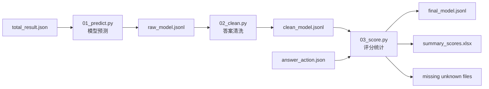

# 汉字结构测评系统


一个用于评估大模型汉字结构变换能力的自动化测评流程。系统会让多个模型根据“词语 + 目标部首”完成逐字变换，并通过清洗、评分和分项统计生成可复现的测评结果。

## ✨ 项目亮点

* **三阶段流水线**：预测 → 清洗 → 评分，结构清晰，便于断点续跑。
* **多模型横向比较**：支持同时评测 Claude、Gemini、GLM、GPT、DeepSeek、Kimi 等模型。
* **细粒度动作统计**：按 `keep`、`add`、`replace`、`delete`、`unknown` 统计每类变换表现。
* **稳健清洗策略**：结合本地规则和清洗模型，从复杂输出中提取最终汉字答案。
* **自动生成 Excel 汇总**：输出模型总分与 action-level 明细，方便做表格分析和展示。
* **unknown 数据回收**：自动导出缺失字典项，方便继续补全 `answer_action.json`。

## 🧠 任务定义

给定一个词语 `phrase` 和一个目标部首 `change`，模型需要对词语中的每个汉字按以下优先级进行变换：

1. **删 delete**：如果原字当前部首就是目标部首，则尝试删去该部首。
2. **加 add**：如果原字加上目标部首能组成新字，则加部首。
3. **换 replace**：如果原字替换为目标部首能组成新字，则换部首。
4. **留 keep**：如果以上规则都不成立，则保持原字不变。

模型最终只应输出与原词等长的汉字串。

## 🗂️ 项目结构

```text
.
├── 01_predict.py              # Phase 1：调用模型生成原始预测
├── 02_clean.py                # Phase 2：清洗模型输出，提取最终答案
├── 03_score.py                # Phase 3：计算准确率并生成汇总表
├── requirements.txt           # Python 依赖
├── README.md
├── total_result.json          # 输入数据：id / phrase / change / replace
├── answer_action.json         # 动作标注字典：add / replace / delete / keep
└── eval_results/
    ├── raw_{model}.jsonl      # Phase 1 输出
    ├── clean_{model}.jsonl    # Phase 2 输出
    ├── final_{model}.jsonl    # Phase 3 输出
    ├── summary_scores.xlsx    # 总分与分项汇总
    ├── missing_txt            # unknown 位置的目标字
    ├── missing_unknown_tasks.json
    └── missing_answer.json
```

## 🔁 Pipeline



## 🚀 快速开始

### 1. 安装依赖

```bash
pip install -r requirements.txt
```

或手动安装：

```bash
pip install openai tqdm openpyxl
```

### 2. 准备输入文件

需要在项目根目录放置：

| 文件                   | 作用                                       |
| -------------------- | ---------------------------------------- |
| `total_result.json`  | 测评样本，包含 `id`、`phrase`、`change`、`replace` |
| `answer_action.json` | 每个“原字 + 目标部首”对应的动作类型                     |

`total_result.json` 示例：

```json
[
  {
    "id": 1,
    "phrase": "春风化雨",
    "change": "氵",
    "replace": "..."
  }
]
```

`answer_action.json` 示例：

```json
{
  "青": {
    "氵": {
      "action": "add"
    }
  }
}
```

### 3. 配置 API

脚本使用 OpenAI-compatible Chat Completions 接口。运行前需要配置：

* `PRIMARY_API_KEY`
* `BACKUP_API_KEY`
* `BASE_URL`

> ⚠️ 不建议把 API Key 直接提交到 GitHub。推荐改为通过环境变量读取，例如 `os.getenv("PRIMARY_API_KEY")`。如果项目已经提交过明文 Key，建议立即在服务商后台撤销旧 Key 并重新生成。

### 4. 运行完整流程

```bash
python 01_predict.py
python 02_clean.py
python 03_score.py
```

三个阶段可以单独重复运行。脚本会尽量复用已有结果，支持断点续跑。

## 📊 当前模型结果

本次汇总共包含 7 个模型，每个模型原始题量为 3,908 条。综合准确率按词语级平均得分计算；action 分项为逐字统计。

| Rank | Model                    | Evaluated | Overall |   Keep |    Add | Replace | Delete |
| ---: | ------------------------ | --------: | ------: | -----: | -----: | ------: | -----: |
|    1 | `gemini-3-pro-preview`   |     3,897 |  74.12% | 73.27% | 68.21% |  69.50% | 90.26% |
|    2 | `gemini-3-flash-preview` |     3,903 |  71.85% | 72.28% | 65.05% |  66.08% | 90.49% |
|    3 | `glm-4.7`                |     3,777 |  57.79% | 59.17% | 47.24% |  54.42% | 90.77% |
|    4 | `claude-opus-4-6`        |     3,894 |  54.56% | 81.96% | 38.19% |  35.53% | 43.26% |
|    5 | `gpt-5.4`                |     3,868 |  42.60% | 58.40% | 35.60% |  27.79% |  2.58% |
|    6 | `kimi-k2.5`              |     3,825 |  37.47% | 58.28% | 21.82% |  21.05% | 23.23% |
|    7 | `deepseek-v3.2`          |     3,857 |  37.06% | 74.27% | 13.09% |  10.94% |  1.18% |

> 结果文件见 `eval_results/summary_scores.xlsx`。其中 `Summary` 是宽表总览，`Action_Details` 是每个模型每个 action 一行的长表明细。

## 📦 输出说明

### Phase 1：预测输出

```text
eval_results/raw_{model}.jsonl
```

每条记录会新增：

```json
{
  "model_prediction": "模型原始输出"
}
```

如果请求失败，脚本会写入 `ERROR:` 记录，并在下一轮集中重试。

### Phase 2：清洗输出

```text
eval_results/clean_{model}.jsonl
```

每条记录会新增：

```json
{
  "cleaned_prediction": "清洗后的最终答案",
  "cleaning_note": "清洗来源或规则说明"
}
```

清洗策略优先使用本地规则，包括：

* 直接保留等长纯汉字输出；
* 从首行或尾行提取等长汉字答案；
* 避免把模型复述的原词误当成最终答案；
* 保留 CJK 扩展区汉字；
* 本地无法提取时，再调用清洗模型。

### Phase 3：评分输出

```text
eval_results/final_{model}.jsonl
eval_results/summary_scores.xlsx
```

每条记录会新增：

```json
{
  "score": 0.75,
  "action_stats": {
    "add": {"total": 2, "correct": 1},
    "replace": {"total": 1, "correct": 1},
    "delete": {"total": 0, "correct": 0},
    "keep": {"total": 1, "correct": 1},
    "unknown": {"total": 0, "correct": 0}
  }
}
```

## 🧩 unknown 辅助文件

当 `answer_action.json` 中缺少某个“原字 + 目标部首”的动作标注时，系统会把它记为 `unknown`，并导出辅助文件：

| 文件                                        | 含义                              |
| ----------------------------------------- | ------------------------------- |
| `eval_results/missing_txt`                | unknown 位置对应的目标字，去重后每 12 字一行    |
| `eval_results/missing_unknown_tasks.json` | 可追溯的缺失任务列表，包含样本 id 和示例          |
| `eval_results/missing_answer.json`        | 尽量兼容原 `answer.json` 结构，方便继续人工标注 |

可以将 `missing_answer.json` 接入原有标注前端，补充完成后再合并回 `answer_action.json`。

## ⚙️ 常用配置

| 配置项           | 所在文件                                            | 说明                     |
| ------------- | ----------------------------------------------- | ---------------------- |
| `MODEL_LIST`  | `01_predict.py` / `02_clean.py` / `03_score.py` | 要评测的模型列表               |
| `MAX_WORKERS` | `01_predict.py` / `02_clean.py`                 | 并发线程数                  |
| `MAX_TRIES`   | `01_predict.py`                                 | 预测阶段大轮次重试次数            |
| `MAX_RETRIES` | `02_clean.py`                                   | 清洗模型请求重试次数             |
| `CHECK_MODEL` | `02_clean.py`                                   | 用于文本清洗的模型              |
| `OUTPUT_DIR`  | 三个脚本                                            | 输出目录，默认 `eval_results` |

## 🔐 安全建议

建议在 `.gitignore` 中加入：

```gitignore
.env
__pycache__/
*.pyc
eval_results/~$*.xlsx
```

如果仓库未来改为公开，请注意：

* 不要提交 API Key、Token、Cookie 等任何密钥。
* 不要提交临时 Excel 文件，例如 `~$summary_scores.xlsx`。
* 如需分享结果，优先分享 `summary_scores.xlsx` 或脱敏后的 JSONL。
* 如果密钥曾经进入 Git 历史，删除当前文件并不等于彻底删除历史记录，需要轮换密钥并清理 Git 历史。

## 📝 Notes

这个项目适合用于观察大模型在汉字结构、部首变换、字形规则和细粒度字符级推理上的差异。由于模型输出可能包含解释、反思或多候选答案，清洗阶段是保证评测稳定性的关键。
